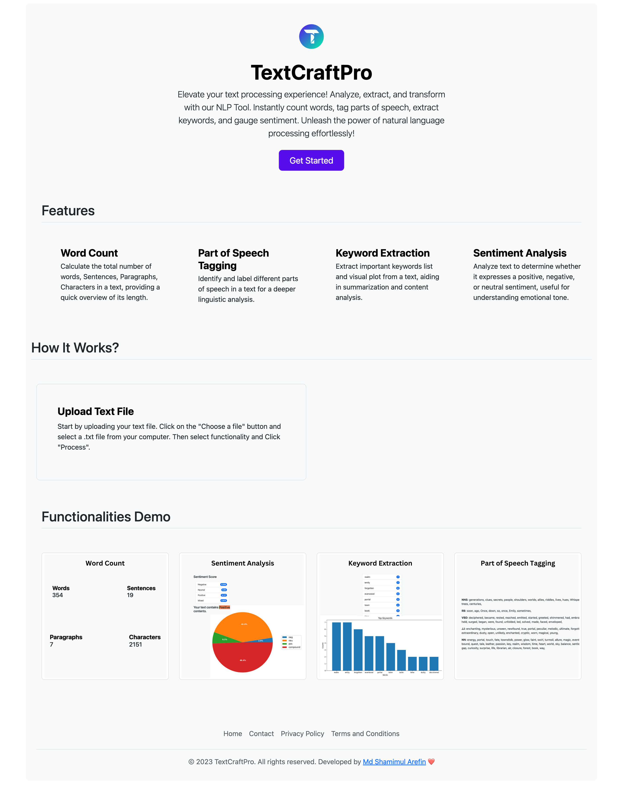
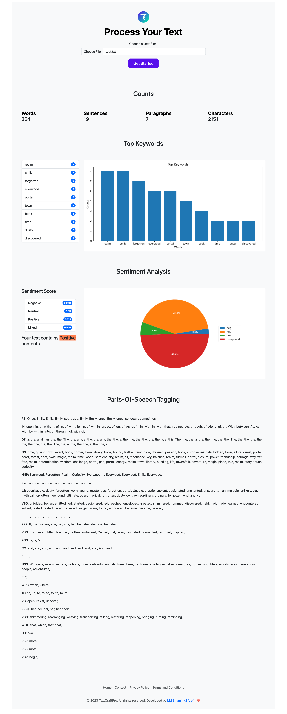

# TextCraftPro

TextCraftPro is a web application that allows users to analyze text documents using NLP techniques. It is built using Python and Flask.

## Table of Contents

- [Project Structure](#project-structure)
- [Installation](#installation)
- [Testing](#testing)
- [License](#license)
- [Demo](#demo)

## Project Structure

Flask Project Structure

TextCraftPro/\
│\
├── TextCraftPro/\
│   ├── __init__.py\
│   ├── config.py\
│   ├── app/\
│   │   ├── __init__.py\
│   │   ├── routes.py\
│   │   ├── uploads/\
│   │   ├── static/\
│   │   └── templates/\
│   │\
│   └── utils/\
│       ├── __init__.py\
|       ├── barplot.py\
│       ├── keyword_extraction.py\
│       ├── pieplot.py\
│       ├── pos_tagging.py\
│       ├── sentiment_analysis.py\
│       └── word_count.py\
│\
├── tests/\
│   ├── __init__.py\
│   ├── test_utils_keyword_extraction.py\
│   ├── test_utils_pos_tagging.py\
│   ├── test_utils_sentiment_analysis.py\
│   └── test_utils_word_count.py\
│
├── requirements.txt\
├── run.py\
└── README.md


## Installation
1. Clone the repository:

```bash
git clone https://github.com/ShamimulArefin/TextCraftPro.git
```
2. Navigate Directory:
```bash
cd TextCraftPro
```
3. Install dependencies:
```bash
pip install -r requirements.txt
```
4. Run the application:
```bash
python run.py
```
## Testing
Run tests using pytest:
```bash
pytest test/test_file_name.py
```
## License
This project is licensed under the MIT License - see the LICENSE file for details.

## Demo

